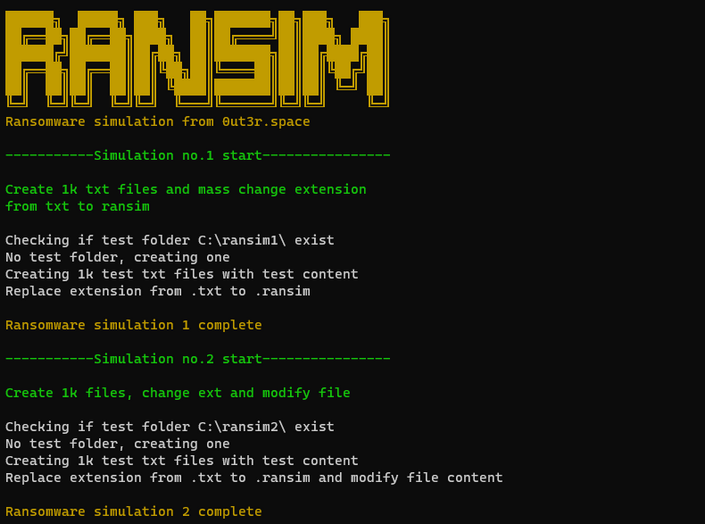

# ransim
Ransomware simulator. 



This script simulates the behavior of ransomware, mass creating files, changing their content and extension. All in a very short time. Script created for testing and building SIEM alerts.


If you run the script it will start two test.
1. First test is to create folder in location C:\ransim1. Inside folder create 1k txt files with test content. Then it will mass change extension from .txt to .ransim.
2. Second test is to create folder in location C:\ransim2. Inside folder create 1k txt files with test content. Then it will mass modify file content and change extension from .txt to .ransim.


If folder ransim1 or ransim2 exists it will delete it and start again.


If you would like to create only test data to manipulate it by yourself use command:

```mkdir C:\ransim\ && 1..1000 | ForEach-Object {Out-File -InputObject 'RansomwareTest' -FilePath C:\ransim\TestTextFile$_.txt}```
