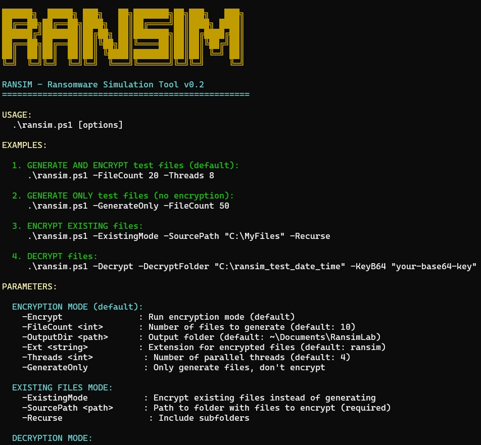

# RANSIM - Ransomware Simulation Tool



A **benign ransomware simulation tool** for educational and testing purposes. This PowerShell script generates test files, encrypts them using AES-256-GCM, and provides decryption capabilities. **This is NOT real malware** – it's a safe simulation for learning and testing security solutions.

## ⚠️ Disclaimer

This tool is designed **ONLY** for:

- Educational purposes
- Testing security software in isolated lab environments
- Understanding ransomware behavior
- Practicing incident response

**DO NOT USE** on production systems or without explicit permission.

## ✨ Features

- 🔐 **AES-256-GCM encryption** – Industry-standard authenticated encryption
- 📁 **Generate test files** – Create realistic test files (TXT, DOCX, XLSX)
- 🔑 **Encrypt existing files** – Test on your own dummy data
- 📝 **README generation** – Saves decryption key and instructions to Desktop
- ⚡ **Multi-threading** – Fast parallel processing
- 🔓 **Decryption mode** – Restore encrypted files with the correct key
- 🚫 **Generate-only mode** – Create files without encryption for testing

## 📋 Requirements

- **PowerShell 7+**
- Windows OS (tested on Windows 10/11)
- Administrator privileges **not required**

## 🚀 Quick Start

### 1. Generate and encrypt test files (default)

```powershell
.\ransim.ps1 -FileCount 20 -Threads 8
```

### 2. Generate files only (no encryption)

```powershell
.\ransim.ps1 -GenerateOnly -FileCount 50
```

### 3. Encrypt existing files

```powershell
.\ransim.ps1 -ExistingMode -SourcePath "C:\TestFiles" -Recurse
```

### 4. Decrypt files (using key from README)

powershell

```powershell
.\ransim.ps1 -Decrypt -DecryptFolder "C:\ransim_test_date_time" -KeyB64 "your-base64-key"
```

## 📚 Complete Parameter Reference

### Encryption Mode (Default)

| Parameter           | Description                        | Default                 |
| :------------------ | :--------------------------------- | :---------------------- |
| `-Encrypt`          | Run encryption mode (implied)      | -                       |
| `-FileCount <int>`  | Number of files to generate        | 10                      |
| `-OutputDir <path>` | Output folder                      | `~\Documents\RansimLab` |
| `-Ext <string>`     | Extension for encrypted files      | `ransim`                |
| `-Threads <int>`    | Number of parallel threads         | 4                       |
| `-GenerateOnly`     | Only generate files, don't encrypt | -                       |

### Existing Files Mode

| Parameter            | Description               | Required |
| :------------------- | :------------------------ | :------- |
| `-ExistingMode`      | Encrypt existing files    | Yes      |
| `-SourcePath <path>` | Path to folder with files | Yes      |
| `-Recurse`           | Include subfolders        | No       |

### Decryption Mode

| Parameter               | Description                  | Required |
| :---------------------- | :--------------------------- | :------- |
| `-Decrypt`              | Run decryption mode          | Yes      |
| `-DecryptFolder <path>` | Folder with encrypted files  | Yes      |
| `-KeyB64 <string>`      | Decryption key in Base64     | Yes      |
| `-DecryptExt <string>`  | Extension of encrypted files | `ransim` |

## 📖 Detailed Examples

### Example 1: Generate and encrypt 50 files with 8 threads

```powershell
.\ransim.ps1 -FileCount 50 -Threads 8
```

**Output:**

```powershell
Created folder: C:\Users\user\Documents\RansimLab\rransim_test_20260225_123456
Created subfolders: 9
[1] a9a668be1b714fa6a3768206afce24a4.docx -> a9a668be1b714fa6a3768206afce24a4.docx.ransim
...
Encryption completed!
Folder: C:\Users\user\Documents\RansimLab\rransim_test_20260225_123456
Encrypted files: 50
README: C:\Users\user\Desktop\README_RANSIM_20260225_123456.txt
Key: +DBkYVPRUyiDPz72TY9RcjeKCrwQOp3lNuogXEg95rY=

Decrypt command:
.\ransim.ps1 -Decrypt -DecryptFolder "C:\Users\user\Documents\RansimLab\rransim_test_20260225_123456" -KeyB64 "+DBkYVPRUyiDPz72TY9RcjeKCrwQOp3lNuogXEg95rY=" -DecryptExt "ransim"
```

### Example 2: Generate only 100 files (no encryption)

```powershell
.\ransim.ps1 -GenerateOnly -FileCount 100 -OutputDir "D:\RansimTests"
```

Useful for creating test data without encryption.

### Example 3: Encrypt existing files in a folder with subfolders

```powershell
.\ransim.ps1 -ExistingMode -SourcePath "D:\TestData\Documents" -Recurse -Ext "locked" -Threads 4
```

### Example 4: Decrypt files using the key from README

```powershell
.\ransim.ps1 -Decrypt -DecryptFolder "C:\ransim_test_20260225_123456" -KeyB64 "+DBkYVPRUyiDPz72TY9RcjeKCrwQOp3lNuogXEg95rY="
```

## 📄 README File Example

After encryption, a README file is saved to the Desktop:

```
===========================================
RANSIM - Ransomware Simulation (v0.2)
===========================================

This is a BENIGN ransomware simulation for testing purposes.
This is NOT a real attack.

DATE: 02/25/2026 17:36:03
FOLDER: C:\Users\user\Documents\RansimLab\rransim_test_20260225_173602
ENCRYPTED FILES: 10
EXTENSION: .ransim

===========================================
DECRYPTION KEY (Base64):
===========================================

+DBkYVPRUyiDPz72TY9RcjeKCrwQOp3lNuogXEg95rY=

===========================================
DECRYPTION INSTRUCTIONS:
===========================================

.\ransim.ps1 -Decrypt -DecryptFolder "C:\Users\user\Documents\RansimLab\rransim_test_20260225_173602" -KeyB64 "+DBkYVPRUyiDPz72TY9RcjeKCrwQOp3lNuogXEg95rY=" -DecryptExt "ransim"

===========================================
```

------

## 🤝 Contributing

Feel free to fork and improve! Pull requests welcome.

## ⭐ Support

If you find this tool useful for testing/learning, give it a star! ⭐
